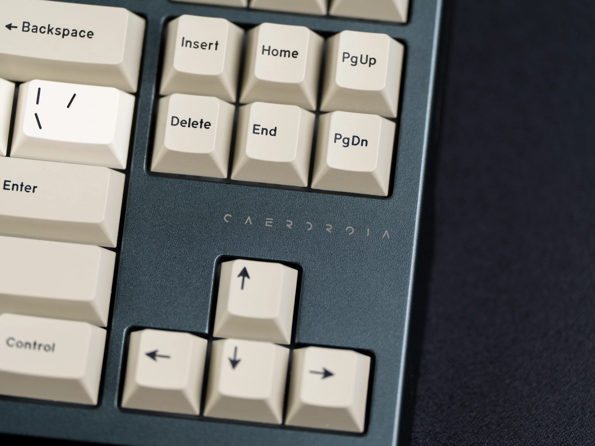
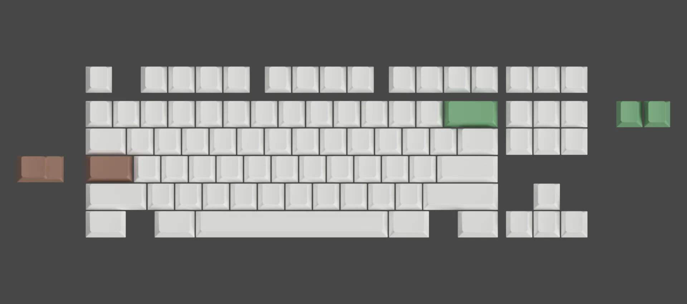
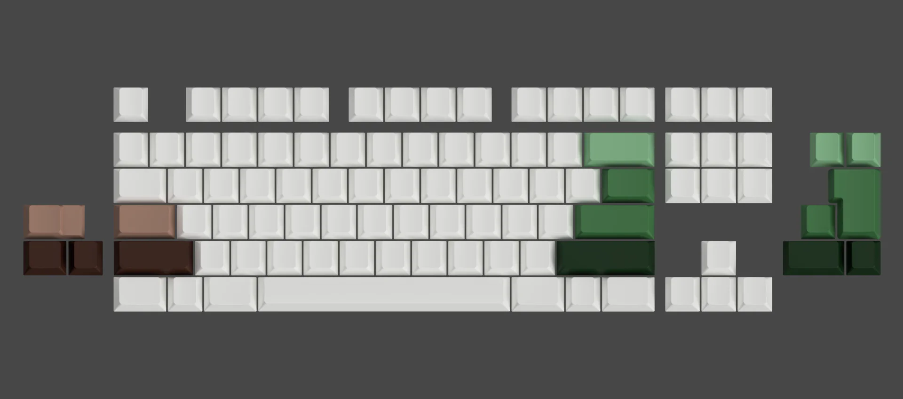
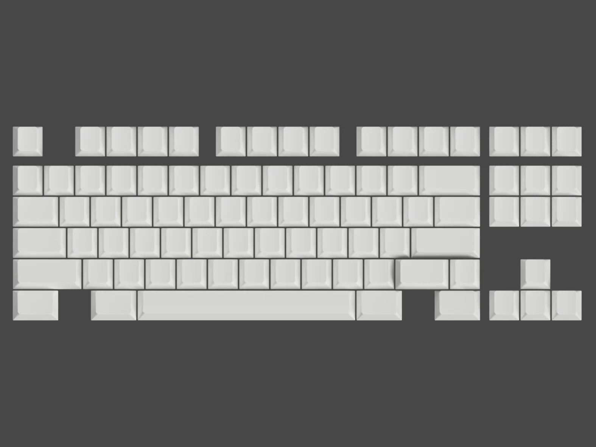

# Caerdroia

> _"Among the roots of the trees you awaken,_
> _Birds leer rapturously upon your disoriented visage,_
> _The redstart solemnizes your parturition with angelic aria,_
> _You recall the year was at its twilight, yet now birthed anew, blossoming with verdant,_
> _All of your consciousness, connected with the weald like hyphae,_
> _Abstracting your past life beyond all fragile recall,_
> _This caerdroia is sacred, you know that you are home now. The trees willed it."_

### Designed with Purpose
At the heart of Caerdroia lies immense attention to detail, and thoughtful design. Designed with two-toned anodization in mind, the details of the design come to life and expose every decision made on the path taken.

### Integrated USB Hub
Clean up that maze of cables on your desk with the built-in USB hub. Featuring two ports of USB passthrough goodness.

### TKL Roots, Reimagined
Caerdroia stays true to the roots of a classic TKL with its F12 forced WKL layout and top mounted structure- but it's not afraid to branch out.

The plate kitted in by default is a 4.5mm thick frosted PC CNC plate. Not for the faint of heart, this plate adds a slight layer of rigidity to the typing feel while not deadening the sound. This allows your build choices to truly shine.

* [Website](https://cannonkeys.com/products/caerdroia)

## Specifications

* F12 WKL Layout
* ~2.8kg built weight
* Anodized aluminum chassis
* Powdercoated brass weight
* 7° typing angle
* 19.5 mm front height
* 4.5 mm thick frosted PC plate
* 2x USB 2.0 passthrough ports

## Layout support

### PC plate support

### Solder PCB support

### Hotswap PCB support

### Alps plate support

## Kit contents

* Caerdroia aluminum case with brass weight
* Solder PCB
* Custom USB-C daughterboard
* Custom USB 2.0 Hub
* JST/Molex cables
* 4.5 mm frosted PC plate
* 4× [AKB Bumpons](https://github.com/akb-repos/feet) – Injection molded silicone
* CannonKeys hard carrying case
* Microfiber cloth
* Screws and hardware for assembly

## Media

### Build streams
* [Upas](https://www.twitch.tv/videos/2100305897)
