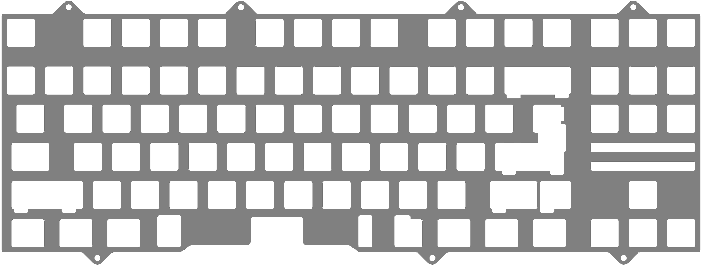
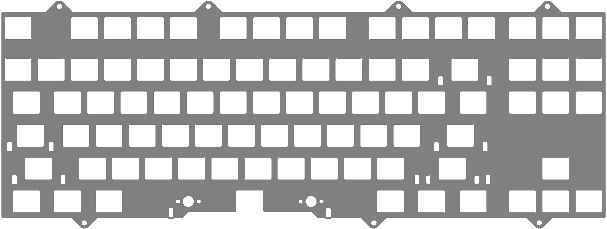

### Caerdroia_MX_Universal_Plate
Universal MX plate

* [Caerdroia_MX_Universal_Plate.step](./Caerdroia_MX_Universal_Plate.step)
* [Caerdroia_MX_Universal_Plate.dxf](./Caerdroia_MX_Universal_Plate.dxf)

### Caerdroia_Alps_ANSI_Alps_Stabs_Plate
ANSI Alps plate for Alps stabilizers, ideal for 1.2 mm thick and stiff plate materials

* [Caerdroia_Alps_ANSI_Alps_Stabs_Plate.step](./Caerdroia_Alps_ANSI_Alps_Stabs_Plate.step)
* [Caerdroia_Alps_ANSI_Alps_Stabs_Plate.dxf](./Caerdroia_Alps_ANSI_Alps_Stabs_Plate.dxf)
